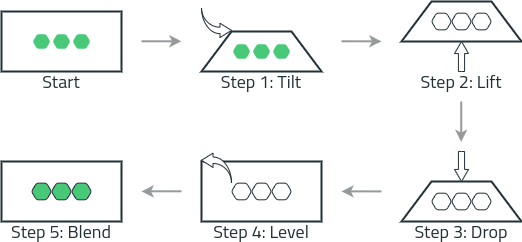
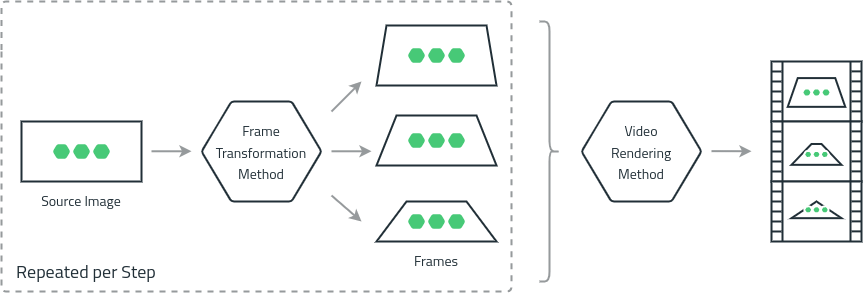
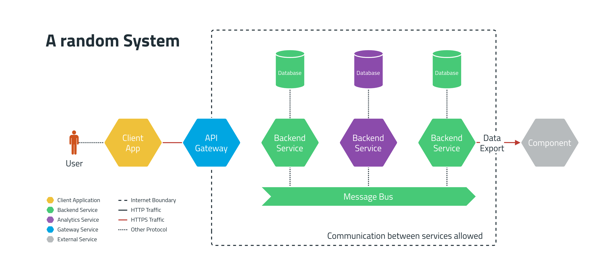
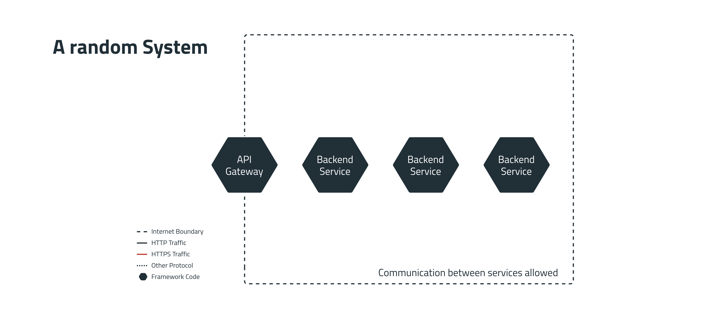

# Animated Diagram Layers

This is the documentation and code of an experiment to animate layers of a
software architecture diagram.

The use-case for this animation was to show the extraction of a framework out of
a microservices architecture. This is visualized by tilting the original
diagram, lifting the framework out of the architecture and then showing the
usage of the framework by the indication of the border color of the hexagons in
the last step.


If you want to find out more about how I draw these diagrams, check out [this
page](https://www.lasssim.com/diagrams).

The whole animation is backed by a Ruby script that can be found in
`src/main.rb` and can be invoked like this:

```bash
$ cd src
$ docker-compose run app
```

## The Animation

The animation is split into multiple steps shown in the following chart.



Tools from Imagemagick are used to transform a single input image to create
frames. `ffmpeg` merges the frames of all steps into a video or animated GIF.



Depending on the desired frame rate of the output animation
the number of frames is calculated based on the desired duration of the
animation steps.

The following sections describe how individual frames are created. **Please keep
in mind, that each command is just creating one frame.**

### Step 1

For tilting the image, I used a script from <a
href="http://www.fmwconcepts.com/imagemagick/3Drotate/index.php">Fred's
ImageMagick Scripts</a>. It is called `3Drotate` and can do exactly what we
need. 

The partly rendered animation of this step looks like this:


#### The Command

```bash
$ 3Drotate \
  tilt=35.0 \
  bgcolor='white -alpha remove -alpha off' \
  '/usr/src/app/layers/0_system.drawio.png' \
  '/usr/src/app/tmp/frames/01-0_system.drawio-tilt-029.png'
```

The preceding command uses these parameters:
| Parameter | Explaination |
| ------- | ------------ |
| `tilt=35.0` | calculated tilt angle of the current iteration |
| `bgcolor='white -alpha remove -alpha off'` | set white background |
| `'/usr/src/app/layers/0_system.drawio.png'` | input filename  |
| `'/usr/src/app/tmp/frames/01-0_system.drawio-tilt-029.png'` | output filename  |


### Step 1.5

This tiny in-between step is not directly used in the resulting animation but
used as an input for the next steps. We need to generate a tilted frame of the
framework diagram. We can use `3Drotate` again.

The created image looks like this: 


#### The Command

```bash

$ 3Drotate \
  tilt=70.0 \
  bgcolor='none' \
  '/usr/src/app/layers/1_framework.drawio.png' \
  '/usr/src/app/tmp/frames/000-1_framework.drawio-tilt-000.png'

```

The preceding command uses these parameters:
| Parameter | Explaination |
| ------- | ------------ |
| `tilt=70.0` | the tilt angle |
| `bgcolor='none'` | we need a transparent background (see next 2) |
| `'/usr/src/app/layers/1_framework.drawio.png'` | input filename  |
| `'/usr/src/app/tmp/frames/000-1_framework.drawio-tilt-000.png'` | output filename  |


### Step 2

The second animation step is to visualize the extraction of the framework by
lifting it out of the tilted overview layer from step 1. To do that I used 

The partly rendered animation of this step looks like this:


#### The Command

```shell
$ convert \
  '/usr/src/app/tmp/frames/01-0_system.drawio-tilt-059.png' \
  -fill white -colorize 66% \
  -page +0-175.0% \
  '/usr/src/app/tmp/frames/000-1_framework.drawio-tilt-000.png' \
  -flatten \
  '/usr/src/app/tmp/frames/02-000-1_framework.drawio-tilt-000-lift-020.png'

```

The preceding command uses these parameters:
| Parameter | Explaination |
| ------- | ------------ |
| `'/usr/src/app/tmp/frames/01-0_system.drawio-tilt-059.png'` | input filename |
| `'-fill white -colorize 66%'` | (calculated) makes the background fade to white |
| `'-page +0-175.0%'` | (calculated) adds a layer on top of the background |
| `'/usr/src/app/tmp/frames/000-1_framework.drawio-tilt-000.png'` | new layer filename |
| `'-flatten'` | flattens the layers |
| `'/usr/src/app/tmp/frames/02-000-1_framework.drawio-tilt-000-lift-020.png'` | output filename |


### Step 3

Step 3 is similar to step 2 but the loop is reversed and the images are created without the fading background image.

The partly rendered animation of this step looks like this:


#### The Command

```bash

$ convert \ 
  -background white \
  -page +0-150.0% \
  '/usr/src/app/tmp/frames/000-1_framework.drawio-tilt-000.png' \
  -flatten \
  '/usr/src/app/tmp/frames/03-000-1_framework.drawio-tilt-000-lift-012.png'

```

The preceding command uses these parameters:
| Parameter | Explaination |
| ------- | ------------ |
| `'-background white'` | solid white background |
| `'-page +0-150.0%'` | (calculated) adds a layer on top of the background |
| `'/usr/src/app/tmp/frames/000-1_framework.drawio-tilt-000.png'` | input filename  |
| `'-flatten'` | flattens the layers |
| `'/usr/src/app/tmp/frames/03-000-1_framework.drawio-tilt-000-lift-012.png'` | output filename  |


### Step 4 

This step tilts the framework back to the original orientation. The framework
diagram is used as input but the loop is reversed.

The partly rendered animation of this step looks like this:


#### The Command

```bash
$ 3Drotate \
  tilt=14.0 \
  bgcolor='white -alpha remove -alpha off' \
  '/usr/src/app/layers/1_framework.drawio.png' \
  '/usr/src/app/tmp/frames/04-1_framework.drawio-tilt-024.png'
```

The preceding command uses these parameters:
| Parameter | Explaination |
| ------- | ------------ |
| `tilt=14.0` | (calculated) tilt angle of the current iteration |
| `bgcolor='white -alpha remove -alpha off'` | solid white background |
| `'/usr/src/app/layers/1_framework.drawio.png'` | input filename  |
| `'/usr/src/app/tmp/frames/04-1_framework.drawio-tilt-024.png'` | output filename  |


### Step 5 

The final step blends the final image over the framework.

The partly rendered animation of this step looks like this:


#### The Command

```bash

convert \
  '/usr/src/app/layers/1_framework.drawio.png' \
  -background white -alpha remove -alpha off \
  \( \
      '/usr/src/app/layers/2_framework_system.drawio.png' \
      -alpha set \
      -channel A \
      -evaluate multiply 0.5 \
      +channel \
  \) \
  -compose over -composite \
  '/usr/src/app/tmp/frames/05-2_framework_system.drawio-fade-015.png'

```

The preceding command uses these parameters:
| Parameter | Explaination |
| ------- | ------------ |
| `'/usr/src/app/layers/1_framework.drawio.png'` | input filename |
| `'-background white -alpha remove -alpha off'` | solid white background |
| `'/usr/src/app/layers/2_framework_system.drawio.png'` | overlay image filename  |
| `'-alpha set'` | add and reset alpha channel |
| `'-channel A'` | select the alpha channel |
| `'-evaluate multiply 0.5'` | (calculated) multiply alpha channel by value |
| `'+channel'` | reset alpha channel |
| `'-compose over -composite'` | composite images |
| `'/usr/src/app/tmp/frames/05-2_framework_system.drawio-fade-015.png'` | output filename |

