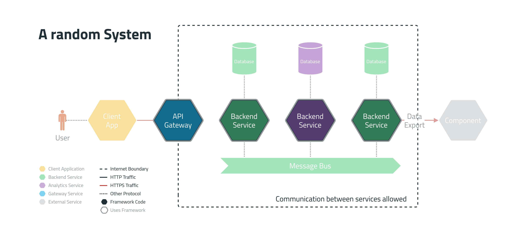

# Animated Diagram Layers

This is the documentation and code of an experiment to animate layers of a
software architecture diagram.

The use-case for this animation was to show the extraction of a framework out of
a microservices architecture. This is visualized by tilting the original
diagram, lifting the framework out of the architecture and then showing the
usage of the framework by the indication of the border color of the hexagons in
the last step.


If you want to find out more about how I draw these diagrams, check out [this
page](https://www.lasssim.com/diagrams).

## Animation Steps and Frame creation

The animation is split into multiple steps shown in the following chart.


Tools from Imagemagick are used to transform a single input image to create
frames. `ffmpeg` merges the frames of all steps into a video or animated GIF.


Depending on the desired frame rate of the output animation
the number of frames is calculated based on the desired duration of the
animation steps.

The following sections describe how individual frames are created. **Please keep
in mind, that each command is just creating one frame.**

### Step 1

For tilting the image, I used a script from <a
href="http://www.fmwconcepts.com/imagemagick/3Drotate/index.php">Fred's
ImageMagick Scripts</a>. It is called `3Drotate` and can do exactly what we
need. 

The partly rendered animation of this step looks like this:


#### The Command

```bash
$ 3Drotate \
  tilt=35.0 \
  bgcolor='white -alpha remove -alpha off' \
  '/usr/src/app/layers/0_system.drawio.png' \
  '/usr/src/app/tmp/frames/01-0_system.drawio-tilt-029.png'
```

The preceding command uses these parameters:
| Parameter | Explaination |
| ------- | ------------ |
| `tilt=35.0` | calculated tilt angle of the current iteration |
| `bgcolor='white -alpha remove -alpha off'` | set white background |
| `'/usr/src/app/layers/0_system.drawio.png'` | input filename  |
| `'/usr/src/app/tmp/frames/01-0_system.drawio-tilt-029.png'` | output filename  |


### Step 1.5

This tiny in-between step is not directly used in the resulting animation but
used as an input for the next steps. We need to generate a tilted frame of the
framework diagram. We can use `3Drotate` again.

The created image looks like this: 


#### The Command

```bash

$ 3Drotate \
  tilt=70.0 \
  bgcolor='none' \
  '/usr/src/app/layers/1_framework.drawio.png' \
  '/usr/src/app/tmp/frames/000-1_framework.drawio-tilt-000.png'

```

The preceding command uses these parameters:
| Parameter | Explaination |
| ------- | ------------ |
| `tilt=70.0` | the tilt angle |
| `bgcolor='none'` | we need a transparent background (see next 2) |
| `'/usr/src/app/layers/1_framework.drawio.png'` | input filename  |
| `'/usr/src/app/tmp/frames/000-1_framework.drawio-tilt-000.png'` | output filename  |


### Step 2

The second animation step is to visualize the extraction of the framework by
lifting it out of the tilted overview layer from step 1. To do that I used 

The partly rendered animation of this step looks like this:


#### The Command

```shell
$ convert \
  '/usr/src/app/tmp/frames/01-0_system.drawio-tilt-059.png' \
  -fill white -colorize 66% \
  -page +0-175.0% \
  '/usr/src/app/tmp/frames/000-1_framework.drawio-tilt-000.png' \
  -flatten \
  '/usr/src/app/tmp/frames/02-000-1_framework.drawio-tilt-000-lift-020.png'

```

The preceding command uses these parameters:
| Parameter | Explaination |
| ------- | ------------ |
| `'/usr/src/app/tmp/frames/01-0_system.drawio-tilt-059.png'` | input filename |
| `'-fill white -colorize 66%'` | (calculated) makes the background fade to white |
| `'-page +0-175.0%'` | (calculated) adds a layer on top of the background |
| `'/usr/src/app/tmp/frames/000-1_framework.drawio-tilt-000.png'` | new layer filename |
| `'-flatten'` | flattens the layers |
| `'/usr/src/app/tmp/frames/02-000-1_framework.drawio-tilt-000-lift-020.png'` | output filename |


### Step 3

Step 3 is similar to step 2 but the loop is reversed and the images are created without the fading background image.

The partly rendered animation of this step looks like this:


#### The Command

```bash

$ convert \ 
  -background white \
  -page +0-150.0% \
  '/usr/src/app/tmp/frames/000-1_framework.drawio-tilt-000.png' \
  -flatten \
  '/usr/src/app/tmp/frames/03-000-1_framework.drawio-tilt-000-lift-012.png'

```

The preceding command uses these parameters:
| Parameter | Explaination |
| ------- | ------------ |
| `'-background white'` | solid white background |
| `'-page +0-150.0%'` | (calculated) adds a layer on top of the background |
| `'/usr/src/app/tmp/frames/000-1_framework.drawio-tilt-000.png'` | input filename  |
| `'-flatten'` | flattens the layers |
| `'/usr/src/app/tmp/frames/03-000-1_framework.drawio-tilt-000-lift-012.png'` | output filename  |


### Step 4 

This step tilts the framework back to the original orientation. The framework
diagram is used as input but the loop is reversed.

The partly rendered animation of this step looks like this:


#### The Command

```bash
$ 3Drotate \
  tilt=14.0 \
  bgcolor='white -alpha remove -alpha off' \
  '/usr/src/app/layers/1_framework.drawio.png' \
  '/usr/src/app/tmp/frames/04-1_framework.drawio-tilt-024.png'
```

The preceding command uses these parameters:
| Parameter | Explaination |
| ------- | ------------ |
| `tilt=14.0` | (calculated) tilt angle of the current iteration |
| `bgcolor='white -alpha remove -alpha off'` | solid white background |
| `'/usr/src/app/layers/1_framework.drawio.png'` | input filename  |
| `'/usr/src/app/tmp/frames/04-1_framework.drawio-tilt-024.png'` | output filename  |


### Step 5 

The final step blends the final image over the framework.

The partly rendered animation of this step looks like this:


#### The Command

```bash

convert \
  '/usr/src/app/layers/1_framework.drawio.png' \
  -background white -alpha remove -alpha off \
  \( \
      '/usr/src/app/layers/2_framework_system.drawio.png' \
      -alpha set \
      -channel A \
      -evaluate multiply 0.5 \
      +channel \
  \) \
  -compose over -composite \
  '/usr/src/app/tmp/frames/05-2_framework_system.drawio-fade-015.png'

```

The preceding command uses these parameters:
| Parameter | Explaination |
| ------- | ------------ |
| `'/usr/src/app/layers/1_framework.drawio.png'` | input filename |
| `'-background white -alpha remove -alpha off'` | solid white background |
| `'/usr/src/app/layers/2_framework_system.drawio.png'` | overlay image filename  |
| `'-alpha set'` | add and reset alpha channel |
| `'-channel A'` | select the alpha channel |
| `'-evaluate multiply 0.5'` | (calculated) multiply alpha channel by value |
| `'+channel'` | reset alpha channel |
| `'-compose over -composite'` | composite images |
| `'/usr/src/app/tmp/frames/05-2_framework_system.drawio-fade-015.png'` | output
filename |

## Video Rendering

Using the frames from the previous steps we can now render a video. I
implemented two methods to render the video. The first method creates an `mp4`
the other method creates a `gif`.

Both methods use the `ffmpeg` command-line tool and use a file called
`render_sequence.ffmpeg.txt` to specify the used frames, their order and the
time between them. See this snippet for an example:

```
file '/usr/src/app/tmp/frames/05-2_framework_system.drawio-fade-000.png'
duration 0.03333333333333333
file '/usr/src/app/tmp/frames/05-2_framework_system.drawio-fade-001.png'
duration 0.03333333333333333
...
```

### MP4

Rendering a video in the `mp4` format is pretty much straightforward.

```bash
ffmpeg \
  -y \
  -hide_banner \
  -loglevel error \
  -f concat \
  -safe 0 \
  -r 30 \
  -i /usr/src/app/tmp/render_sequence.ffmpeg.txt \
  -vf scale=1920:-1 \
  /usr/src/app/out/animation.mp4
```

| Parameter | Explaination |
| ------- | ------------ |
| `'-y'` | overwrite output file |
| `'-hide_banner'` | hide ffmpeg banner |
| `'-loglevel error'` | only show errors |
| `'-f concat'` | concatenate input files |
| `'-safe 0'` | disable safe mode (suppress warning, we have full control over the input files anyway) |
| `'-r 30'` | set framerate to 30 (calculated) |
| `'-i /usr/src/app/tmp/render_sequence.ffmpeg.txt'` | input filename |
| `'-vf scale=1920:-1'` | scale the video to width 1920, "-1" keeps the aspect ratio and calculates the height |
| `'/usr/src/app/out/animation.mp4'` | output filename |

### GIF

Rendering a video in the `gif` format is pretty much similar to the `mp4` video.
But for the `gif` format, we need to use a complex filter. 


```bash
ffmpeg \
  -y \
  -hide_banner \
  -loglevel error \
  -f concat \
  -safe 0 \
  -r 30 \
  -i /usr/src/app/tmp/render_sequence.ffmpeg.txt \
  -filter_complex '[0:v] fps=15,scale=w=720:h=-1,split [a][b];[a] palettegen=stats_mode=single [p];[b][p] paletteuse=new=1' \
  /usr/src/app/tmp/animation_tmp.gif
```

| Parameter | Explaination |
| ------- | ------------ |
| `'-y'` | overwrite output file |
| `'-hide_banner'` | hide ffmpeg banner |
| `'-loglevel error'` | only show errors |
| `'-f concat'` | concatenate input files |
| `'-safe 0'` | disable safe mode (suppress warning, we have full control over the input files anyway) |
| `'-r 30'` | set framerate to 30 (calculated) |
| `'-i /usr/src/app/tmp/render_sequence.ffmpeg.txt'` | input filename |
| `-filter_complex '[0:v] fps=15,scale=w=720:h=-1,split [a][b];[a] palettegen=stats_mode=single [p];[b][p] paletteuse=new=1'` | see below |
| `'/usr/src/app/tmp/animation_tmp.gif'` | output filename |

The complex filter is where most of the magic happens. The basic idea is to
create a custom color palette for each frame and use it to render the frame in
the gif. While this creates a larger file, I found that this produces way better
colors.

An alternative would be to generate a single color palette for all
frames, but this is more complicated in the sense that you need to know how to
generate this palette. You need to basically find a frame that has all the
colors you need, which is not easy to automate.

Read up more details [here](https://medium.com/@Peter_UXer/small-sized-and-beautiful-gifs-with-ffmpeg-25c5082ed733).

| Parameter | Explaination |
| ------- | ------------ |
| `[0:v]` | select the first video stream |
| `'fps=15'` | set the framerate to 15 (calculated) |
| `'scale=w=720:h=-1'` | scale the video to width 720, "-1" keeps the aspect ratio and calculates the height |
| `'split [a][b]'` | split the video into two streams |
| `'[a]'` | select the first stream |
| `'[b]'` | select the second stream |
| `'[a] palettegen=stats_mode=single' [p]` | generate a palette for the first stream |
| `[b][p] 'paletteuse=new=1'` | use the palette for the second stream |

The last step for a proper `gif` is to optimize it using `gifsicle`. This
reduces the file size a little.

```bash
gifsicle \
  --colors 256 \
  -O3 \
  /usr/src/app/tmp/animation_tmp.gif \
  -o /usr/src/app/out/animation.gif
```

| Parameter | Explaination |
| ------- | ------------ |
| `'--colors 256'` | set the number of colors to 256 |
| `'-O3'` | optimize the gif, level 3 |
| `'/usr/src/app/tmp/animation_tmp.gif'` | input filename |
| `'-o /usr/src/app/out/animation.gif'` | output filename |

## Code

The whole animation is backed by a Ruby script that can be found in
`src/main.rb`. Read it from the bottom up.

It deliberately is kept simple and within one file. My goal was to automate and
document the way the animation is created.

There is one thing to mention: The method `when_things_changed` implements a
caching mechanism to prevent the script from rendering frames that are not
changed. To do this, this method creates two temporary files per frame. The
first simply stores the raw command that is executed, and the other stores a
hex-digest of the input file.

### Running it

Clone the repository and run the following command:

```bash
$ cd src
$ docker-compose run app
```

The output will look something like this:

```bash
$ docker-compose run app
[✓] Operation: tilt | Nr. Frames:  60 | File: 0_system.drawio.png
[✓] Operation: tilt | Nr. Frames:   1 | File: 1_framework.drawio.png
[✓] Operation: lift | Nr. Frames:  30 | File: 000-1_framework.drawio-tilt-000.png
[✓] Operation: lift | Nr. Frames:  30 | File: 000-1_framework.drawio-tilt-000.png
[✓] Operation: tilt | Nr. Frames:  30 | File: 1_framework.drawio.png
[✓] Operation: fade | Nr. Frames:  30 | File: 2_framework_system.drawio.png
[✓] Rendering: /usr/src/app/out/animation.mp4 | Nr. Frames: 250 -> Duration: ~8s
[✓] Rendering: /usr/src/app/out/1_overview.mp4 | Nr. Frames:  60 -> Duration: ~2s
[✓] Rendering: /usr/src/app/out/2_framework_lift.mp4 | Nr. Frames:  30 -> Duration: ~1s
[✓] Rendering: /usr/src/app/out/3_framework_lift_reverse.mp4 | Nr. Frames:  30 -> Duration: ~1s
[✓] Rendering: /usr/src/app/out/4_framework_tilt_reverse.mp4 | Nr. Frames:  30 -> Duration: ~1s
[✓] Rendering: /usr/src/app/out/5_framework_system_fade_over.mp4 | Nr. Frames:  30 -> Duration: ~1s

```

### Enjoy

Feel free to ask questions, report bugs, fork, modify or send pull requests. I
would love to hear from you.