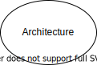

# My Service Docs

This is my general description. Add a diagram here.



## Data Structure

```plantuml
@startuml
!include my_service/doc/classes.iuml 
@enduml
```

## API

{{ api_spec_link("my_service/doc/api.oas3.yaml", "API Documentation") }}